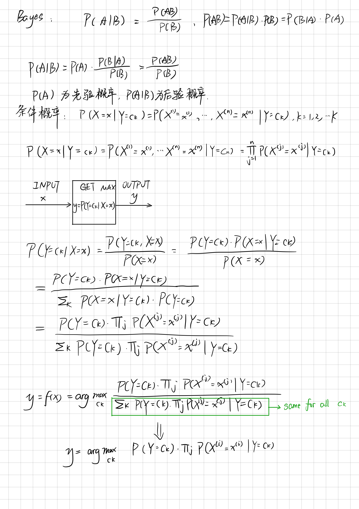
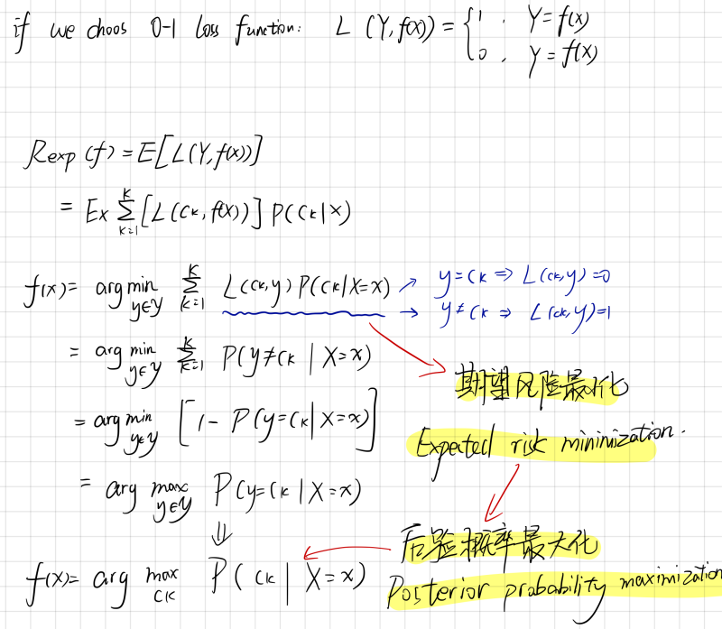
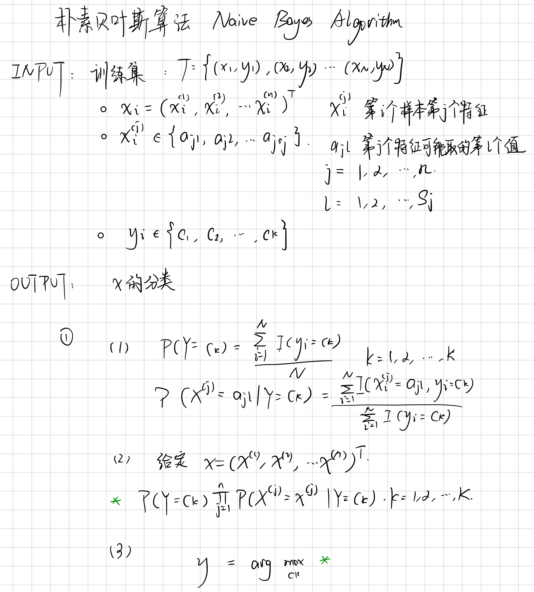
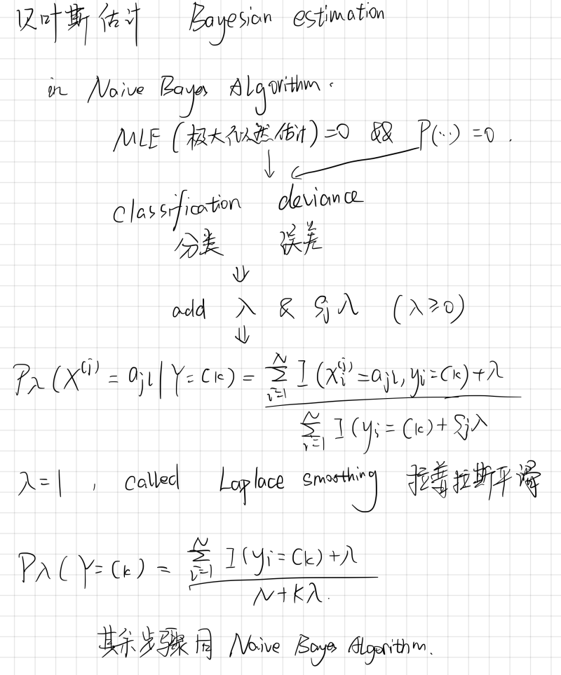

# Naive Bayes 朴素贝叶斯
* 基于贝叶斯定理和特征条件独立假设的分类方法。

## 基本方法
* 对于训练集：
    1. 首先基于特征条件独立假设学习输入输出的联合概率分布
    2. 基于模型，对于给定的输入x，利用贝叶斯定理求出后验概率最大的输出y。

### 后验概率最大化的意义
* 

## 朴素贝叶斯的参数估计
* 应用极大似然估计法估计相应的概率

## 朴素贝叶斯算法
* 

## 贝叶斯估计
* 